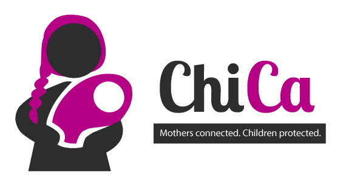
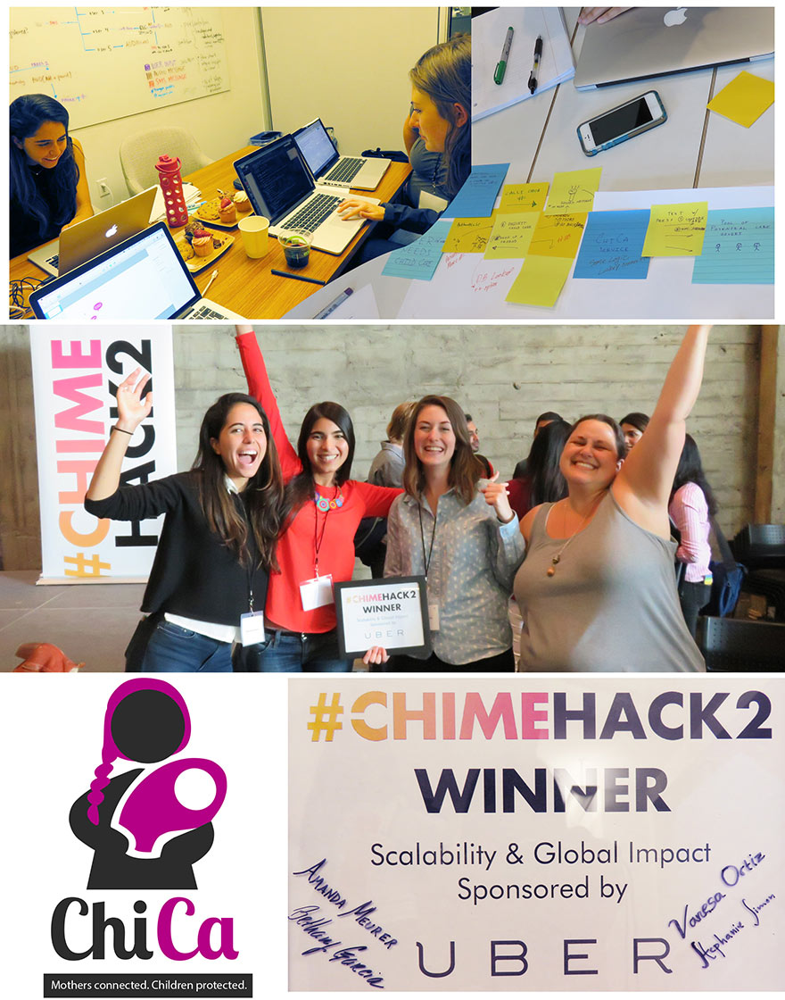

# ChiCa - Mothers connected. Children protected.

ChiCa enables mothers in developing countries to create trusted childcare networks.

##### Winner of the ChimeHack2 Hackathon UBER SCALABILITY AND GLOBAL IMPACT PRIZE

Inspiration
----------------
Team member Vanesa Ortiz volunteered at a children's aid project in the Dominican Republic, where she's from. She noticed the dilemma working mothers in slums face - needing to work (usually far from home), but not being able to afford adequate childcare, and are thus forced to leave their young children alone. Young girls are especially at risk in these perilous situations.

We created ChiCa to connect mothers to exchange childcare at no cost to each other. The requesting mother brings extra food to the caregiver for their children and as an incentive to the caregiver.

ChiCa is accessible to women who may not have smartphones. ChiCa is SMS- and call-based, and works on feature phones (as well as smartphones). Also, by focusing on voice input, versus text, we even reach women who may not be literate.

How it works
----------------
ChiCa is a feature-phone-based childcare platform powered by Twilio and Flask that connects mothers to exchange childcare at no cost to each other (see [workflow](https://www.dropbox.com/s/g4syt3ck497dhb4/presentationslide.pdf?dl=0)).

We're proud of creating a solution for a real problem, and working from the start to create a product for mothers to help themselves (vs. imposing).

Built With
----------------
Twilio, Flask, Python

Workflow
------------
See a **detailed workflow on this [spreadsheet](https://www.dropbox.com/s/g4syt3ck497dhb4/presentationslide.pdf?dl=0) ** and a **live DEMO on [Youtube](https://www.youtube.com/watch?v=CIjC6uw9b_M) **.
Follow us on [Twitter](https://twitter.com/Team_ChiCa)!
